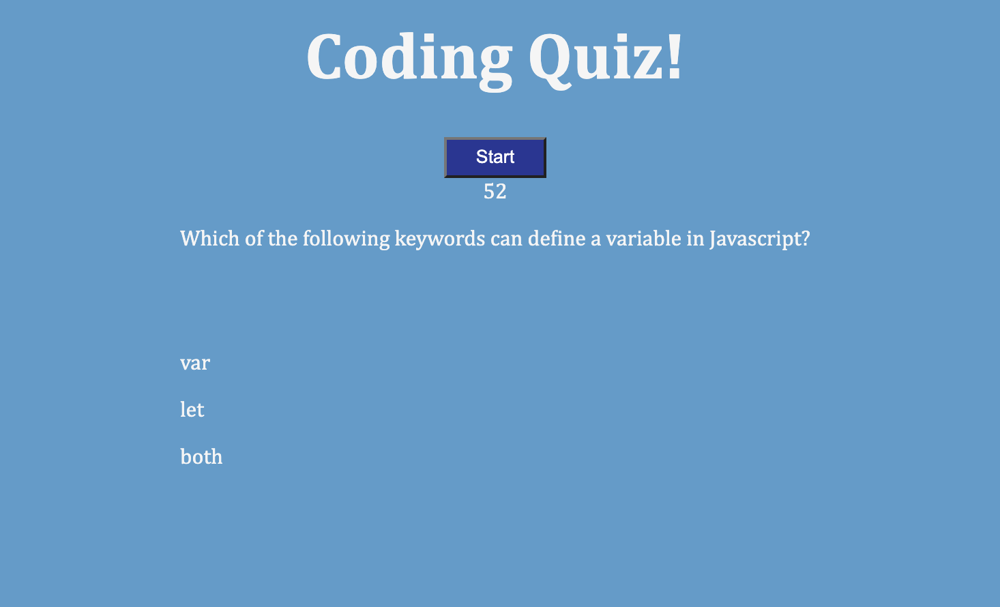
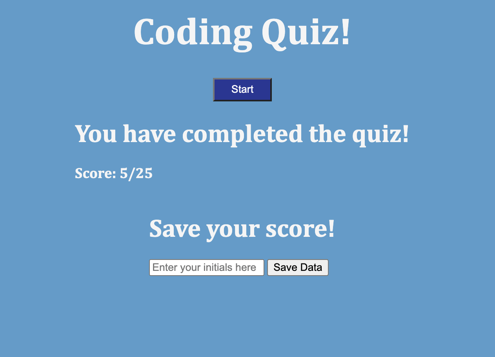

# My First Coding Quiz  

## Description
  This project is a simple coding quiz that asks the user five simple coding questions, tracks their score as they answer the questions, and has a time limit of 60 seconds. If a wrong answer is selected, five extra seconds will be subtracted from the timer. When the timer reaches zero, a game over message is shown to the user and they are given the option to refresh the page and begin the quiz again. Further development on this project will include saving user data into locale storage, such as their score and their initials.

## Screenshots

## Installation 
  This application can be downloaded from my GitHub profile.

## Usage
  This can be used for a quick simple coding practice test on fundamental Javascript concepts.

## Contributing
  The user is free to use this application as they choose. Further plans for development include adding the ability to save scores and user initials into local storage and displaying them on the page at the end of the quiz.

## Tests
  This app can be launched within your browser for use and testing.

  ## License
  This repo is licensed under [MIT License](https://opensource.org/licenses/MIT).

  ## Questions
  Email address: dejuliusvince@gmail.com  
  GitHub: dejuliusvince

  ## Links
  link to deployed app: https://dejuliusvince.github.io/Coding_Quiz/  
  link to GitHub repository: https://github.com/dejuliusvince/Coding_Quiz

  